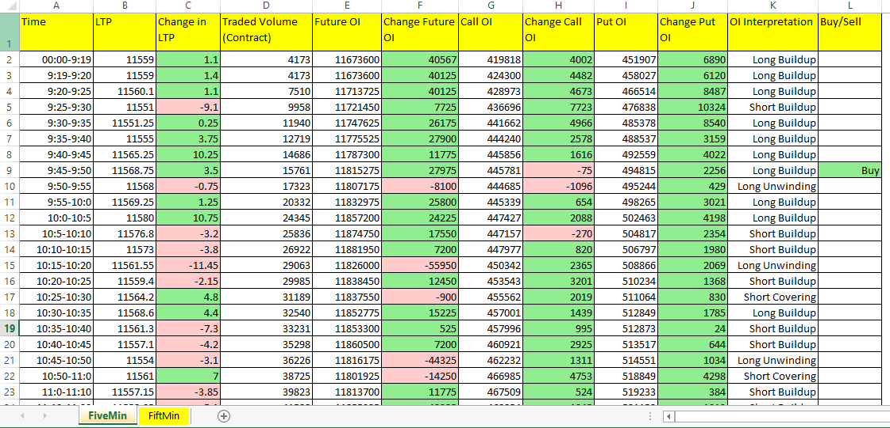
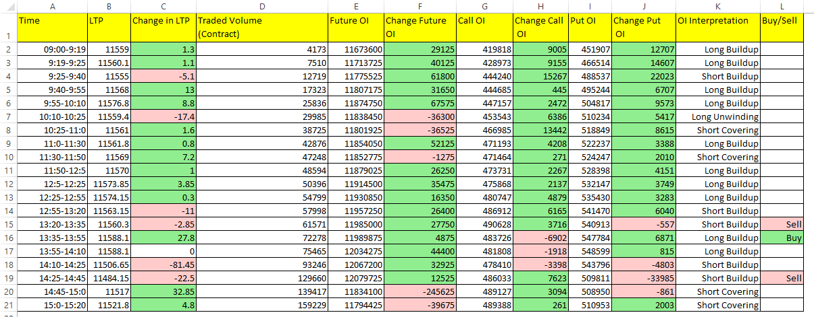
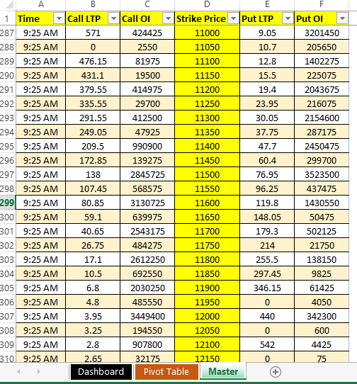

# Open Interest(OI) Analysis

This python script helps in analysis of NSE Nifty Futures and Options Open Interest data.
## Nifty Future OI Analysis
### 1. Five Min Nifty Future OI analysis
Script fetch Nifty Futures data per 5 Min from official NSE website (https://www1.nseindia.com/) and save inside OiAnalysis.xlxs in FiveMin sheet and gives BUY/SELL signal based on Change in OI and Change in LTP along with OI Interpretaion (i.e Long Build Up, Short Buildup, Long Unwinding and Short Covering)

### 2. Fifteen Min Nifty Future OI analysis
Script fetch Nifty Futures data per 15 Min from official NSE website (https://www1.nseindia.com/) and saves inside OiAnalysis.xlxs in FiveMin sheet and gives BUY/SELL signal based on Change in OI and Change in LTP along with OI Interpretaion (i.e Long Build Up, Short Buildup, Long Unwinding and Short Covering)

## Nifty Option Chain OI Analysis
Script fetch Nifty Option Chain data per 5 min for every Strike Price from official NSE website (https://www1.nseindia.com/) and save inside OptionChain.xlsm. This data is saved in Master sheet which is further used by Pivot Table sheet to filter out data based on Strike Prices. All the Call/Put data is represented on Dashboard sheet in form of OI vs LTP graph. 

### 1. Dashboard

### 2. Pivot Table

### 3. Master Sheet

